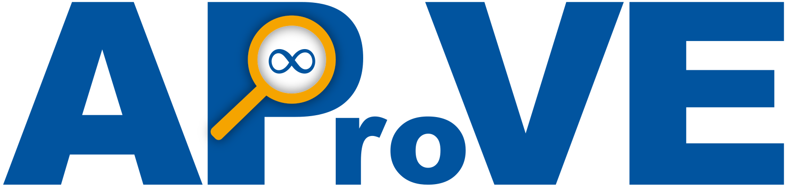
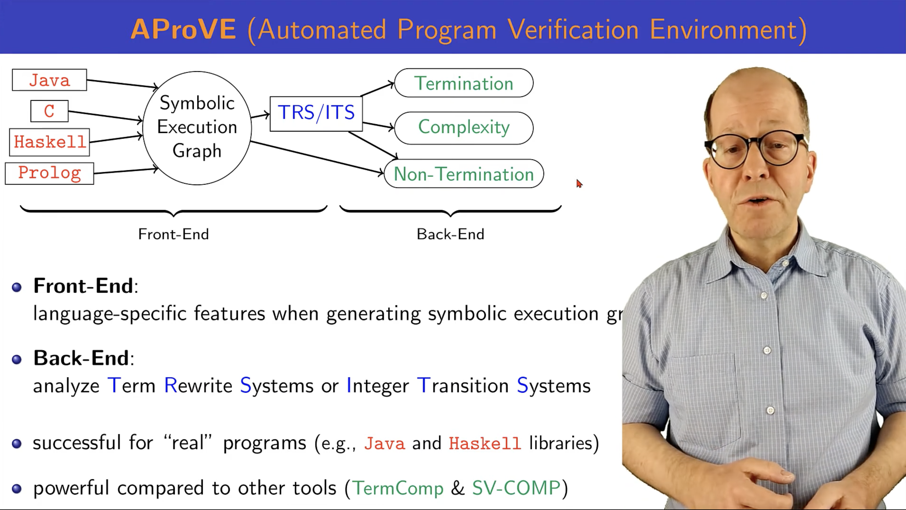

# 🔎 AProVE — Automated Program Verification Environment

  

  Automated reasoning about program termination and complexity.

---

## 📖 What is AProVE?

**AProVE** is an automated tool for analyzing **termination** and **complexity** of programs. It is mainly developed at the <a href="https://verify.rwth-aachen.de/index.html#research">*Programming Languages and Verification*</a> group at RWTH Aachen University.

At its core, AProVE answers questions like:

- *Does a given program always terminate on every possible input?*
- *What are lower/upper bounds on the worst-case time complexity of a given program?*

To guarantee correctness of software, especially for safety-critical and distributed systems, testing alone is insufficient, making formal verification based on mathematical proofs necessary. AProVE is able to automatically verify software without needing to rely on tests or on difficult mathematical proofs written by a human expert.
It supports multiple programming languages like Java, C, Haskell, or Prolog by transforming them into formal representations and applying advanced verification techniques. 

## 🎥 Introduction

  

## 🧠 Core Idea

AProVE follows a **transform-and-analyze** approach:

1. Convert a program into a formal **problem representation**
2. Apply **processors** to transform the problem into simpler ones
3. Use **solvers** to derive results
4. Combine results into a final answer like ✅ `YES` — program terminates; ❌ `NO` — program does not terminate; or ❓ `MAYBE` — inconclusive.  Or it provides bounds on the worst-case time complexity like `O(1)` — constant time complexity; `O(n^1)` — linear time complexity; or `EXP` — exponential time complexity.

## 🏗️ Architecture Overview

The core parts of AProVe consists of <b>problems</b>, <b>processors</b>, <b>strategies</b>, and <b>solvers</b>.

### 🔹 Problems

A **Problem** represents the current state of analysis. E.g., Java programs → `JAVA Problem` or Term rewrite systems → `TRSProblem`

### 🔹 Processors

Processors are the **core engine** of AProVE.
They transform problems into simpler ones or directly produce results.

### 🔹 Strategies

A **strategy** determines: which processors to apply, in what order, and under which conditions.

### 🔹 Solvers

By **Solvers** we mean every tool that is able to mathematically proof certain problems, e.g., we use SAT solvers to prove satisfiyability of SAT formulas, SMT solvers to prove satisfiyability of SMT formulas over different theories, or specialized domain solvers like KoAT to compute upper bounds on the complexity of an integer transition system.

## 🤝 Contributing

We welcome contributions!

### 🛠️ Getting Started

To set up AProVE for development, follow the official guide:

https://github.com/aprove-developers/aprove-open-source/wiki

### 🧩 Extensibility

AProVE is designed to be extensible:

<ul style="list-style-type: none;">
  <li>➕ Add new languages and implement new problem types</li>
  <li>➕ Create new processors to enhance existing analysis or to analyze new problem types</li>
  <li>➕ Integrate additional solvers as backend tools like modern SAT or SMT solvers</li>
</ul>